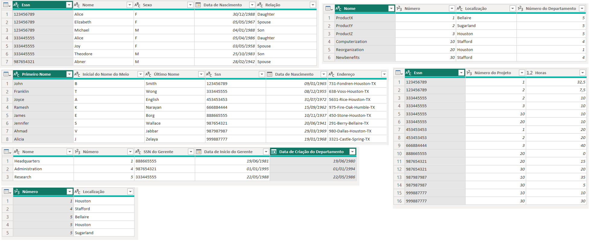

# Desafio: Processando e Transformando Dados com Power BI

Nesse desafio, foram extraídos dados de um Banco de dados MySQL. Esses dados
então foram transformados para que a análise fosse criada.

A primeira etapa foi a exclusão dos campos de metadados do banco de dados e 
ajustes nos cabeçalhos e tipos de dados:

O campo de salário foi ajustado para o tipo double preciso:

Apenas um employee não tinha Super_ssn, indicando que este era um gerente.
Não havia departamento sem gerente.

As tabelas employee e departament foram mescladas em uma nova tabela chamada
"Employee x Departament", associando o nome dos departamentos aos colaboradores:

Posteriormente, foi realizada a junção dos colaboradores e respectivos nomes dos
gerentes:

As colunas de Nome e Sobrenome foram mescladas para ter apenas uma coluna, 
definindo os nomes dos colaboradores:

Os nomes de departamentos e localização também foram mesclados. Isso fez com que
cada combinação departamento-local seja único, auxiliando na criação do modelo
estrela:

Por fim, o seguinte relatório foi construído:

## Documentos

- [Arquivo do Projeto - Power BI](Desafio.pbix)
- [Script do Banco de Dados](script_bd.sql)
